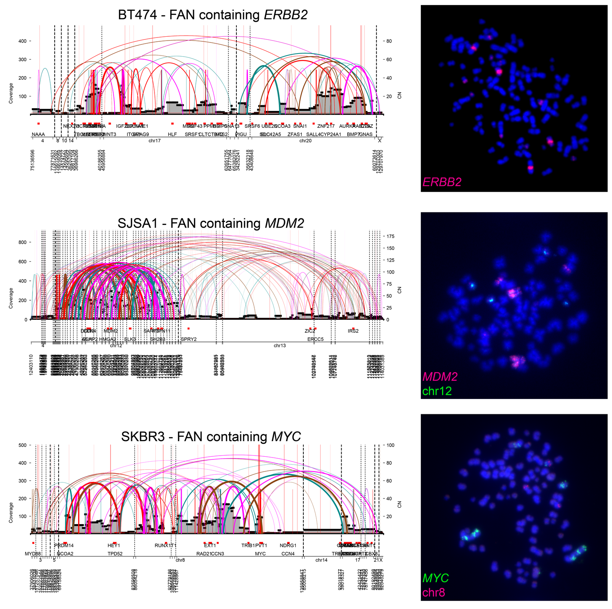
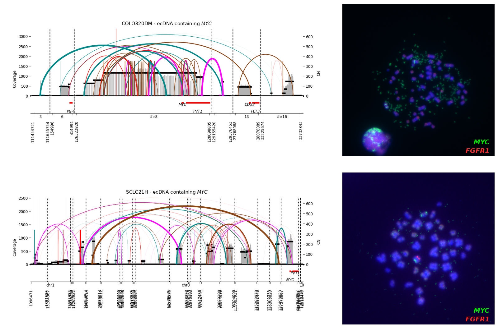

# FAN: Focal Amplification in Neochromosome

AmpliconClassifier (AC) 2.0 introduces a new mechanistic call, **FAN** (focal
amplification in neochromosome). This page explains what a FAN is, how it
differs from the amplification classes AC already reported, and what a FAN call
looks like in practice. It is intended as a practical orientation for users encountering the
`FAN+` column.

---

## 1. What is a FAN?

A **FAN** (focal amplification in neochromosome) is a focal oncogene amplification that is **broad, structurally
complex, and multi-chromosomal**, and that predominantly resolves into a chromosomally
integrated structure rather than an extrachromosomal circle.

A *neochromosome* is a large, structurally rearranged chromosome assembled *de
novo* from amplified material, frequently drawing on several chromosomes of
origin and carrying amplified oncogenes ([Garsed et al., *BioEssays* 2009](https://doi.org/10.1002/bies.200800208);
[Garsed et al., *Cancer Cell* 2014](https://doi.org/10.1016/j.ccell.2014.09.010)). 
In the strict cytogenetic sense a neochromosome is a supernumerary element, stabilized either
by a neocentromere formed at a previously non-centromeric locus or by a native
centromere captured from one of the contributing chromosomes. FAN is the term we
introduce for the focal amplifications that sit inside such structures.

Not every FAN reported by AC is a neochromosome in that strict sense. Some present as derivative chromosomes;
homogeneously staining regions embedded in a heavily rearranged host chromosome rather
than as free-standing supernumerary elements. Short-read WGS alone cannot
separate the two, and cytogenetic characterization is required to do so. In fact distinguishing a neochromosome from a 
derivative marker chromosome becomes subjective at a certain point of complexity. Regardless, what the FAN call captures
is the genomic signature the two share: broad, multi-chromosomal, and SV-dense and likely to be chromosomally embedded.

The cytogenetic underpinnings of FAN have been recognized for
decades. Marker ring chromosomes were described as a defining feature of lipogenic
tumors ([Heim et al., *Cancer Genetics and Cytogenetics* 1987](https://pubmed.ncbi.nlm.nih.gov/3466681/)),
and FISH was later used to trace the rings and giant marker chromosomes, showing for example that at least five 
chromosomes contributed to structures with constant co-amplification of *SAS* and *MDM2*
([Pédeutour et al., *Genes, Chromosomes and Cancer* 1994](https://doi.org/10.1002/gcc.2870100203)).
These observations were unified under the term
"cancer-associated neochromosome" (Garsed et al., 2009), and genome-scale
sequencing later showed that neochromosomes arise as circular structures, pass
through breakage-fusion-bridge cycles, and stabilize through neocentromere
formation or native centromere capture (Garsed et al., 2014). FANs are the
WGS-detectable footprint of this class of event.

The defining contrast is with ecDNA, which can also be structurally complex and chromothripsis-associated. Both are 
focal oncogene amplifications, but appear differently in their construction:

| | **ecDNA**                                     | **FAN**                                                       |
|---|-----------------------------------------------|---------------------------------------------------------------|
| Physical form | Extrachromosomal circle                       | Chromosomally integrated / neochromosomal                     |
| Genomic territory | Compact, typically a few Mb                   | Broad, tens to hundreds of Mb                                 |
| Copy number | More likely to be uniform across the element  | **Heterogeneous** across the amplicon                         |
| Chromosomes of origin | Frequently one dominant locus                 | Two or more, each contributing substantial amplified material |
| SV content | Variable number of junctions relative to size | Dense, with many large or interchromosomal junctions          |

These contrasts are quantitative, not merely conceptual. Applying AC 2.0 to the
published pan-cancer AmpliconArchitect calls of
[Kim et al., *Nature Genetics* 2024](https://doi.org/10.1038/s41588-024-01949-7)
(available through [AmpliconRepository.org](https://ampliconrepository.org)), the
492 `FAN+` amplicons have a median amplified span of 61 Mb against 3.6 Mb for
`ecDNA+` amplicons, a median of 38 large or interchromosomal junctions against 2,
and only 10% of FANs are confined to a single chromosome against 64% of `ecDNA+`
amplicons.

A useful intuition: **ecDNA tend to be sharper and better circumscribed; a FAN is wide and rugged.** 
A possible misreading of the FAN call is to assume it means "a very
large amplification." It does not. Neither does copy number alone make a FAN; see
the ecDNA contrasts in §3.2, which include complex high copy number amplicons yet are firmly FAN-negative.

In AC's classifications, FAN is also **not mutually exclusive** with the other mechanistic calls. A FAN
event can incorporate ecDNA and BFB-type mechanisms within the same
amplification, so `FAN+` can co-occur with `ecDNA+` and `BFB+` on one amplicon
(SNU16 amplicon1 is `FAN+` and `ecDNA+` in our cell-line panel; see §4). Treat
`FAN+` as an independent flag, not as a competing label.

**Not every HSR is a neochromosome, either.** Cytogenetically a FAN presents as a
homogeneously staining region (HSR), but so does a breakage-fusion-bridge (BFB)
amplification, and the two arise by different processes. A BFB cycle begins with
the loss of a telomere and proceeds by repeated sister-chromatid fusion and
anaphase breakage, so it builds its amplified material out of a single
chromosome arm, at or near the locus of origin, through nested fold-back
inversions that leave a stepwise copy-number profile. A neochromosome instead
assembles material from two or more chromosomes into a structure whose junctions
are heterogeneous in orientation and frequently interleaved rather than nested,
and whose amplified segments often come to rest away from their native locus. In
our cell-line panel the two calls separate cleanly: the `BFB+` amplicons are
compact, carry at most a handful of large or interchromosomal junctions, and
none of them reaches a FAN probability of 0.01. That separation is a property of
the data rather than a rule in the code, and nothing prevents both flags from
firing on an amplicon that genuinely contains both processes.

### **Related but distinct phenomena.** 
Two recently described patterns overlap with FAN in appearance and are worth separating from it.

***Loss-translocation-amplification (LTA) chromothripsis***
([Espejo Valle-Inclán et al., *Cell* 2025](https://doi.org/10.1016/j.cell.2024.12.005))
is a mechanism in which a single double-strand break in or near *TP53* leaves an
unprotected chromosomal end that fuses to another chromosome, forming a dicentric chromosome
that then undergoes successive BFB cycles. The result is concomitant biallelic
*TP53* inactivation and oncogene amplification, often drawing material from
several chromosomes. LTA chromothripsis was reported to account for roughly half of high-grade
osteosarcomas. However, LTA occurs at low frequency in other soft-tissue sarcomas, and is rare elsewhere, with
0.7% of tumors pan-cancer for TP53-anchored events and 0.6% for events anchored at other tumor suppressors, 
with no clear enrichment in epithelial cancers.

A FAN lacking any evidence of a locus-anchored initiating breakpoint would 
not qualify as LTA under the original definition, and a single-chromosome FAN (e.g., chr12 alone) is in any case 
mechanistically inconsistent with LTA, which requires a translocation to a partner chromosome to form the initiating 
dicentric. LTA names a specific initiating event at a specific locus, whereas FAN describes the resulting 
architecture wherever it arises. Importantly, we observed FAN architecture in cancers not enriched for LTA in the 
pan-cancer screen (e.g., breast cancer, melanoma), suggesting FAN's structural signature can arise through more than 
one upstream mechanism.

***Tyfonas***
([Hadi et al., *Cell* 2020](https://doi.org/10.1016/j.cell.2020.08.006))
are similar to FAN in many ways. Tyfonas are also detected from junction-balanced genome
graphs (using the JaBbA/gGnome framework) and like FANs are enriched in dedifferentiated liposarcoma and acral 
melanoma. The Hadi et al., 2020 study suggested that tyfonas are chromosomally integrated (demonstrated in NCI-H526 via Hi-C 
and FISH), and noted that in dedifferentiated liposarcoma tyfonas likely correspond to the supernumerary ring chromosomes 
long described in sarcomas ([Pédeutour et al., *Cancer Genetics and Cytogenetics* 1993](https://pubmed.ncbi.nlm.nih.gov/8500103/)). 
They speculated that the complex integrated structure may require a transient extrachromosomal phase during formation, 
like the Garsed et al., 2014 study. Their reasoning and ours converge on much of the same biology.

Where the two differ is in which graph features do the discriminating, and, more
consequentially, in whether the resulting labels are allowed to combine.

In the JaBbA/gGnome framework, the tyfonas call splits first on how much of an amplicon's copy number is carried
on fold-back junctions. Fold-backs are the structural signature of the
breakage-fusion-bridge cycle. Amplicons meeting the foldback junction criteria are divided into BFB cycles and tyfonas 
by how many distinct high-copy junctions they
carry, and the two are mutually exclusive by construction: an amplicon is one or
the other, never both. Amplicons below the line are read as double minutes (ecDNA).

FAN uses no fold-back feature at all. In fact, based on analysis of the 492 `FAN+`
amplicons in the [Kim et al., *Nature Genetics* 2024](https://doi.org/10.1038/s41588-024-01949-7) pan-cancer data, 
41% of FANs carry a summed fold-back inversion junction copy number below a quarter of their highest segment copy
number, the level at which the [tyfonas classifier routes an amplicon onto its BFB
and tyfonas decision branch (GitHub)](https://github.com/mskilab-org/gGnome/blob/68810f4b59773e2f78058bf299c846e77d890b0b/R/eventCallers.R#L3547-L3626).
Requiring high CN fold-backs would discard a large share of genuine
FANs. Instead, AC's FAN definition is built from how much genomic span the
amplicon covers, the balance of chromosomes contributing, and whether its junctions
interleave or nest. In AmpliconClassifier, `FAN+`, `BFB+`, and `ecDNA+` are independent flags that
can fire together on a single amplicon.

That difference is not cosmetic. In some models of neochromosome formation, a
circle grows through repeated bridge cycles (Garsed et al., 2014), so bridge
activity and neochromosomal architecture belong to one history and a single
amplicon may legitimately show both. A scheme in which tyfonas and BFB are
opposite outcomes of one test cannot express that, whereas `FAN+` together with
`BFB+` can say it directly. Co-occurrence is real but somewhat rare: across the pan-cancer set above, 92% of `FAN+` 
amplicons carry no other mechanistic flag, 5% are also `ecDNA+`, and 4% also `BFB+`. The asymmetry runs the other way 
too: in the JaBbA/gGnome framework a broad, multi-chromosomal neochromosome that never accumulated high fold-back weight
(perhaps because it formed through non-bridge-based mechanisms) could fall to the double-minute side of the decision tree.
As a corolary, complex ecDNA with high CN foldbacks (e.g. SNU16, SCLC21H, COLO320DM) may be routed to the tyfonas 
decision branch in the JaBbA/gGnome framework.

FAN is therefore deliberately agnostic about how the copies were made. It does not
require bridge cycles, does not exclude them, and does not treat their presence as
evidence against a neochromosomal architecture.

---

## 2. How AmpliconClassifier calls FAN

Every amplicon is scored by a lightweight logistic-regression model that reads
the AmpliconArchitect breakpoint graph and computes five features:

| Feature | What it captures |
|---|---|
| `amplified_span_mb` | Genomic territory of the amplification: per-chromosome coordinate envelope of segments above the CN floor (default 4), summed over chromosomes. |
| `sv_qualifying_inter_or_large` | Count of SV junctions that are interchromosomal or intrachromosomal and >1 Mb (short <50 kb deletions/duplications are excluded). A measure of long-range SV burden. |
| `chrom_dominant_frac` | Fraction of amplicon sequence contributed by its single largest chromosome. **Low** values mean the material is spread across chromosomes. |
| `sv_crossing_frac` | Fraction of qualifying junctions that span at least one other junction's breakpoint, i.e. how interleaved, rather than nested and orderly, the rearrangements are. |
| `amplified_cn40_span_mb` | Envelope span of segments above CN 40. Acts mainly as a suppressor: compact, very-high-CN ecDNA concentrates its signal here. |

The model outputs a probability; `fan_call` applies a decision threshold of
**0.5**. All weights are compiled into `ampclasslib/fan_ml.py`. There is no
external model file and nothing to download or configure.

**How the model was built.** Labels came from manual review of AmpliconArchitect
reconstructions in existing pan-cancer focal-amplification calls
([Kim et al., *Nature Genetics* 2024](https://doi.org/10.1038/s41588-024-01949-7))
and in cancer cell lines, with each amplicon annotated as FAN-like or not and
weighted by the annotator's confidence. Candidate models were fit and compared
under cross-validation grouped by sample, so that amplicons from the same tumor
never appeared in both training and evaluation, and were then scored on
held-out amplicons that played no part in model development. The feature set was
deliberately kept small in favor of interpretability. Orthogonal confirmation
comes from the cytogenetically characterized cell lines of Luebeck et al.,
*Nature Methods* 2026 (in press), where a call can be checked against metaphase FISH; the
examples in §3 are drawn from that panel.

**Where the FAN results appear in AC outputs:**

- `[prefix]_amplicon_classification_profiles.tsv`: the `FAN+` column
  (`Positive` / `None detected`), alongside `ecDNA+` and `BFB+`.
- `[prefix]_fan_calls.tsv`: per-amplicon `fan_call`, `fan_probability`, and all
  five feature values. This is the file to consult when you want to understand
  *why* an amplicon scored the way it did.
- `[prefix]_result_table.tsv`: FAN-positive amplicons appear as a numbered
  feature `FAN_1`, with a `FAN probability` column.
- FAN intervals are written as `[sample]_amplicon[N]_FAN_1_intervals.bed`.

---

## 3. Examples

The examples below are cell lines from our validation panel, classified with
AmpliconClassifier 2.0.0 against hg38. Each row pairs the AmpliconArchitect
amplicon plot (copy number across the amplified segments, with SV junctions
drawn as arcs) with metaphase FISH from the same line (aggregated in Luebeck et al., 2026).

In the FAN examples the probe
signal is **clustered and chromosome-associated** into large homogeneously staining region (HSR) amplifications. In the ecDNA examples it is
**dispersed as many small, separate puncta** through the spread: double
minutes, physically independent of any chromosome.

### 3.1 Three FANs

**BT474 *ERBB2* amplicon** (FAN probability 0.996) is a breast cancer cell line which shows that high copy number is 
not required at all: not one segment exceeds CN 40. chr17 and chr20 contribute almost equally, giving
the lowest `chrom_dominant_frac` in the panel, with *ERBB2* and *ZNF217*
amplified together across the two chromosomes. SKY karyotyping data of BT474 shows a near-tetraploid line with nine 
stable marker chromosomes, several of unresolved origin, including a der(11)t(8;17;11) present in all metaphases 
([Kytölä et al., *Genes, Chromosomes and Cancer* 2000](https://pubmed.ncbi.nlm.nih.gov/10862037/);
[Rondón-Lagos et al., *Molecular Cytogenetics* 2014](https://doi.org/10.1186/1755-8166-7-8))

**SJSA1 *MDM2* amplicon** (0.997): is an osteosarcoma cell line with amplified material
across chr4, chr12, and chr13 with the densest SV burden in the panel, carrying
*MDM2*, *CDK4*, *DDIT3*, *GLI1*, and *HMGA2* together in one structure.

**SKBR3 *MYC* amplicon** (0.945), a breast cancer cell line is the broadest FAN example, drawing on chr3, chr8, chr14, 
and chr17 and co-amplifying *MYC* and *ERBB2*. Its peak copy number is *lower* than
SJSA1's; it is called on breadth and multi-chromosomal spread, not amplitude.
The SKBR3 SKY karyotype independently identifies a der(?)t(20;3;8;17;19;8;3;13), a derivative chromosome assembled from 
segments of six chromosomes that cannot be assigned to any parental chromosome, consistent with the neochromosomal 
interpretation of this FAN call ([Kytölä et al., *Genes, Chromosomes and Cancer* 2000](https://pubmed.ncbi.nlm.nih.gov/10862037/);
SKY karyotype data via [Cellosaurus CVCL_0033](https://www.cellosaurus.org/pawefish/BreastCellLineDescriptions/sk-br-3.html))

### 3.2 Two complex ecDNA, for contrast

**COLO320DM *MYC* amplicon** (FAN probability 0.031) is a complex *MYC* ecDNA
([Alitalo et al., *PNAS* 1983](https://doi.org/10.1073/pnas.80.6.1707)). Its copy number 
is the highest of the examples shown here, and three times SJSA1's peak. COLO320DM contains tight inversions, but the 
amplification is compact, and nearly all of it sits above CN 40.

**SCLC21H *MYC* amplicon** (0.071) is a chromothriptic ecDNA
([Stephens et al., *Cell* 2011](https://doi.org/10.1016/j.cell.2010.11.055)) and removes the easy explanation that FAN just means
"big" or synonymous with chromothripsis: its 143 Mb envelope essentially matches SJSA1's 141 Mb, and it is highly
complex, contains foldbacks, yet it is firmly FAN-negative by AC. `chrom_dominant_frac` is 0.84, meaning chr8 dominates,
against 0.49 for BT474's genuinely co-dominant pair.

Neither negative call means the amplicon is simple. Both of these are among the
most structurally complex ecDNA in our collection of FISH-analyzed ecDNA.

### 3.3 The five amplicons side by side

| Amplicon                 | FAN prob. | span (Mb) | SVs | chrom_dominant | crossing | CN>40 span (Mb) |
|--------------------------|---|---|---|---|---|---|
| SJSA1 *MDM2* amplicon    | 0.997 | 140.8 | 176 | 0.63 | 0.73 | 73.3 |
| SKBR3 *MYC* amplicon     | 0.945 | 248.5 | 68 | 0.78 | 0.64 | 12.5 |
| BT474 *ERBB2* amplicon   | 0.996 | 56.8 | 41 | 0.49 | 0.69 | 0.0 |
| COLO320DM *MYC* amplicon | 0.031 | 3.7 | 12 | 0.61 | 0.62 | 3.4 |
| SCLC21H *MYC* amplicon   | 0.071 | 143.1 | 41 | 0.84 | 0.71 | 116.5 |

**A caution on reading span.** `amplified_span_mb` is a per-chromosome coordinate
envelope (§2), not a count of amplified bases. SCLC21H's 143 Mb envelope contains
only about **2 Mb** of sequence above the CN floor, scattered as widely separated
islands; SJSA1's near-identical envelope is filled by roughly **18 Mb** of real
amplified material, and BT474's much smaller envelope by **30 Mb**. A wide
envelope can mean a genuinely broad amplification or just a few distant
fragments; the other features are what tell them apart.

---

## 4. What changed from AmpliconClassifier 1.X

**All three FAN examples above were reported simply as `ecDNA+` by earlier
versions of AmpliconClassifier.** Under AC 1.5.X, SJSA1 amplicon2, SKBR3
amplicon1, and BT474 amplicon6 each carried `ecDNA+: Positive`; FAN did not
exist as a category, so a broad, cyclic-looking neochromosomal amplification had
nowhere else to go and was absorbed into the ecDNA call. In 2.0 the same three
amplicons are `FAN+: Positive` with `ecDNA+: None detected`.

The mechanism is a deliberately strict gate. When the FAN classifier fires, AC
no longer accepts the ordinary cyclic evidence as sufficient for an ecDNA call:
it retains only circular cycles larger than 250 kbp in which **every** segment's
graph copy number exceeds `fan_ecDNA_min_cn` (default **60**).

**If you are comparing cohorts across versions,** expect some amplicons to move
from `ecDNA+` to `FAN+`. This is the intended behavior change, not a
regression. Amplicons affected are broad and SV-dense, so the shift concentrates
in the complex tail of the cohort rather than in ordinary focal ecDNA. In the
Kim et al. pan-cancer set, 372 of the 492 amplicons that AC 2.0 calls `FAN+`
(76%) had been called `ecDNA+` under AC 1.5.X, and almost all of the rest had
been `Complex-non-cyclic`. The FAN gate is not the only reason `ecDNA+` counts
fall in 2.0: a comparable number of amplicons (296) move from `ecDNA+` to `BFB+`
because of an unrelated improvement to BFB detection.
`[prefix]_fan_calls.tsv` gives the per-amplicon detail needed to audit any
change you see.

---

## 5. Interpreting a FAN call

**ecDNA is very plausibly involved in forming a FAN.** An extrachromosomal intermediate is a natural route to a 
neochromosome: ecDNA can rapidly accumulate high copy number through unequal segregation without requiring breakpoint 
re-use and act as a substrate for combining distant regions of chromosomes. Subsequent chromosomal integration of that 
amplified material yields exactly the broad, SV-dense, multi-chromosomal structure that defines a FAN. FAN-positive 
amplicons should therefore be considered ecDNA-competent as they may have passed through an ecDNA intermediate, they 
may still harbor rare ecDNA subclones alongside the dominant integrated structure, and they may re-enter an 
extrachromosomal state under the right selective pressures. What the FAN call says is narrower than any of this: the 
structure best supported by this bulk reconstruction is neochromosomal rather than a circle. A FAN call describes the 
dominant architecture the data support, not the full evolutionary history of the amplification, and it should not be 
read as excluding a past, concurrent, or future extrachromosomal population. Single-cell or cytogenetic data remain the 
way to detect a residual ecDNA subclone.

**Cytogenetic expectation.** In cell-line FISH validation, FAN calls
corresponded predominantly to non-native HSRs (amplified material integrated at
a chromosomal location other than the locus of origin), consistent with the
neochromosomal interpretation. No FAN call corresponded to a double minute
alone; where a FAN-classified amplicon coincided with a FISH-observed DM, that
amplicon was also called `ecDNA+`. The converse does not hold: an HSR on FISH is
consistent with a FAN but does not imply one, since BFB amplifications produce
HSRs as well (§1). Distinguishing them needs the breakpoint structure, not the
cytogenetic appearance.

**Cancer type distribution.** FAN rates vary widely by tumor type, and users
should calibrate their expectations accordingly. Across the 6,506 tumors of the
Kim et al. pan-cancer set reclassified with AC 2.0, 7.2% of samples carry at
least one `FAN+` amplicon. The rate is highest in breast cancer (24.0%,
217/904), bone and soft tissue tumors (12.1%, 35/290), and skin cancers (10.8%,
44/406), the three highest of any cancer type with more than 50 samples. These
are the same tumor types in which supernumerary ring and giant marker
chromosomes have been extensively described cytogenetically
([Mandahl et al., *Genes, Chromosomes and Cancer* 2024](https://doi.org/10.1002/gcc.23214)),
and in which tyfonas are enriched (Hadi et al., 2020). These figures describe
what AC 2.0 reports on that dataset; because the same dataset also contributed
training labels, they are not an independent estimate of FAN prevalence.

**A few practical notes:**

- `FAN+` is an independent mechanistic flag and can co-occur with `ecDNA+` and
  `BFB+`; do not treat the three as a single-choice label, and note that the
  abstract `amplicon_decomposition_class` is a separate axis again. Independent
  does not mean unrelated, though: as §4 describes, a FAN call does raise the
  evidence bar an ecDNA call must clear within that amplicon.
- `fan_probability` is a model score, not a calibrated posterior over
  biological ground truth. For borderline amplicons near 0.5, inspect the
  feature values in `_fan_calls.tsv` and the AA plot before committing to an
  interpretation.

---

## 6. Summary

FAN is a new category introduced with AmpliconClassifier 2.0 representing amplifications that appear embedded in neochromosomes. 
They are recognized by the combination of broad genomic territory, a dense burden
of large or interchromosomal rearrangements, and amplified material drawn from
more than one chromosome, a signature that separates them from the better circumscribed ecDNA. 
For existing users the practical consequence is that some amplicons previously reported by AC 1.X as `ecDNA+` are now
reported as `FAN+`, with `[prefix]_fan_calls.tsv` file reporting the per-amplicon features.
The full description of the phenotype, the model's derivation, and its validation are in
preparation; this page is intended to give users a working sense of what the `FAN+` flag means.

For the output-format details referenced above, see the
[README](../README.md#3-outputs).
